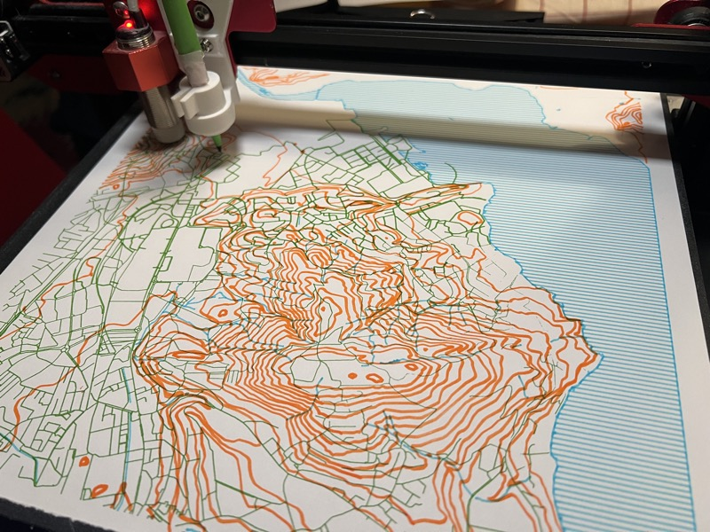
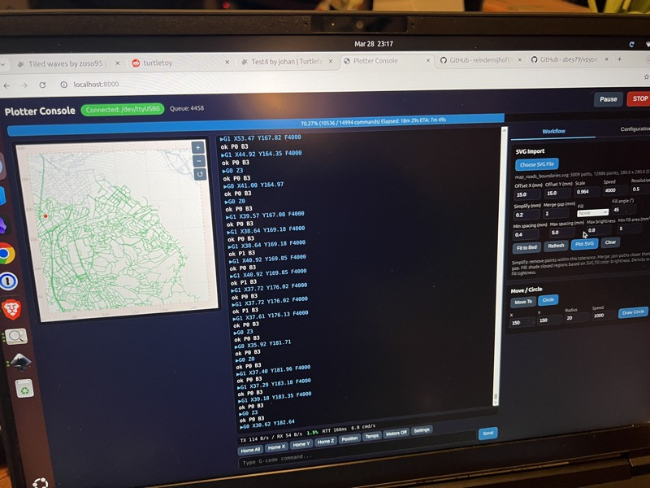
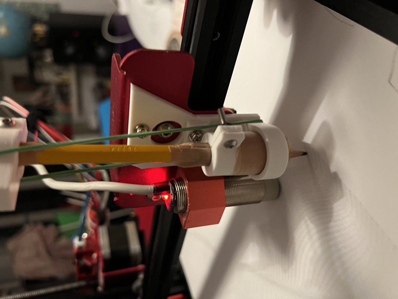
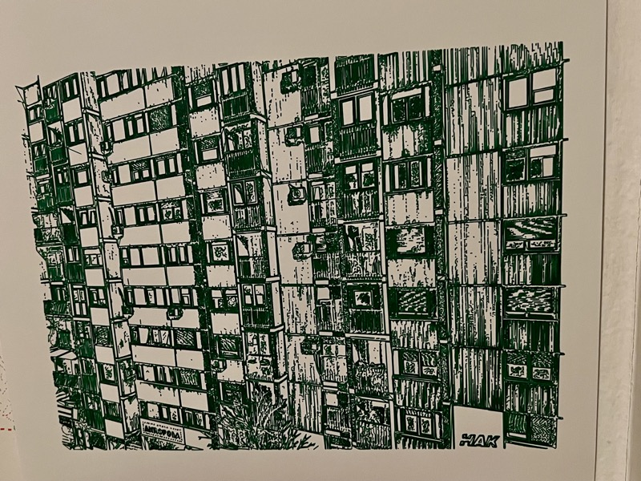
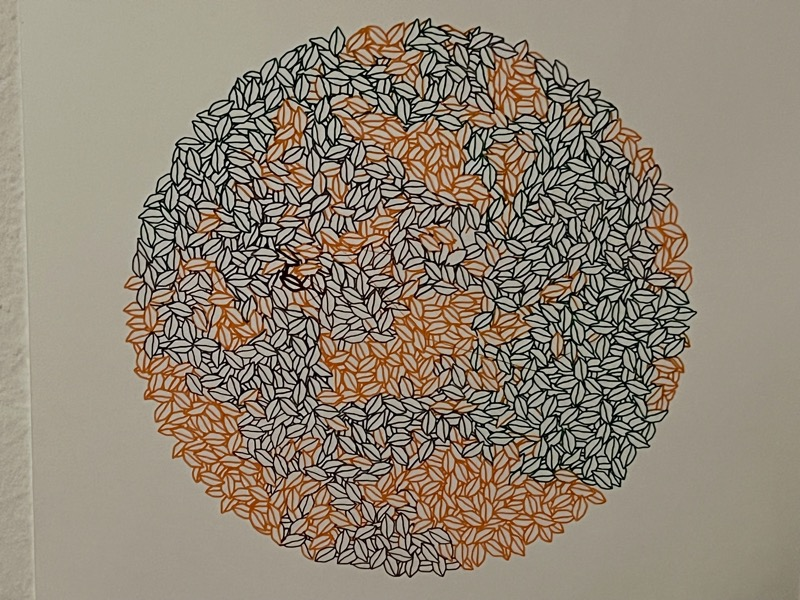

# Plotter

Web UI for controlling a 3D printer (Marlin firmware) as a pen plotter over serial.



## Features

- Serial console with real-time output from the printer
- Pen up/down control with adjustable Z heights
- SVG file import with preview, scaling, and fit-to-bed
- Handles large/complex SVGs (100K+ paths) — server-side preprocessing, spatial-grid path optimization, batched command sending
- Circle drawing with G2 arc commands
- Real-time serial throughput stats (TX/RX bytes/sec, saturation, RTT, commands/sec)
- Emergency stop and serial reset
- Command queue with Marlin ok-based flow control
- Fill/shading support for closed paths (hatch, crosshatch, dots) with brightness-based density



## Setup

```bash
python3 -m venv .venv
.venv/bin/pip install -r requirements.txt
```

## Usage

```bash
.venv/bin/python server.py
```

This starts the server on port 8000 with auto-reload — any changes to `.py`, `.html`, `.js`, or `.css` files will restart the server automatically.

Open http://localhost:8000

## Configuration

Edit `server.py` to change:
- `SERIAL_PORT` — defaults to `/dev/ttyUSB0`
- `BAUD_RATE` — defaults to `115200`

## Tests

```bash
.venv/bin/pytest
node tests/test_plotter.js
```

Tests cover:

- **API endpoints** (`tests/test_api.py`) — SVG preprocessing endpoint (parsing, transforms, simplification, bounding boxes, error handling), static file serving, and port listing API
- **SVG processing** (`tests/test_svg_processing.py`) — unit tests for `parse_svg_path_to_subpaths` (line/curve/arc commands, relative coordinates, implicit repeats, subpaths), `apply_transform` (translate, scale, matrix, combined), and `douglas_peucker` path simplification
- **Client-side plotter logic** (`tests/test_plotter.js`) — path optimization (simplify, sort, merge), coordinate transforms, bounds checking, G-code generation, and SVG element conversion

## Tools

The `tools/` directory contains standalone generators and utilities for creating plotter-ready SVG artwork (Perlin landscapes, typography posters, calibration grids, map conversion). See [tools/README.md](tools/README.md) for details.

## Hardware

Developed for a Creality CR-10S Pro (300x300mm bed) but should work with any Marlin-based printer. A 3D-printed pen holder replaces the hotend nozzle and holds standard pens or pencils. The [3D models made in OnShape](https://cad.onshape.com/documents/b5af320602202ab4c920d13a/w/362c66d8c3042909616ba64c/e/07d05e9df060f64c96a42995?configuration=List_F7ej7qpsreIBt7%3DDefault&renderMode=0&uiState=69ce8d0960be72a4dbce4519) are available to clone or export as STL files for printing.



### Example Outputs

| | |
|---|---|
|  |  |
