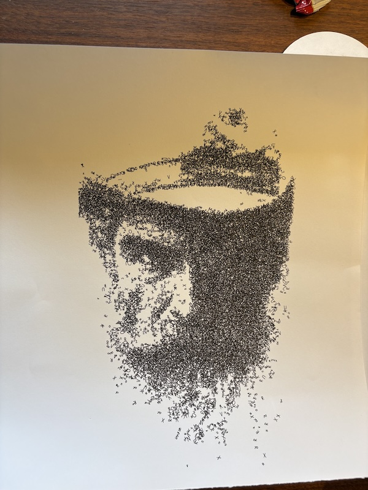
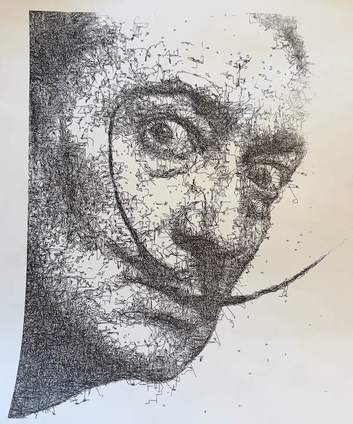

# Tools

Standalone generators and utilities for creating plotter-ready SVG artwork.

## Artwork Generators

### `beatles_typography.py`

Generates a wandering-ribbon typographic poster from Beatles lyrics using the Relief SingleLine plotter font.

On first run, lyrics are fetched from [tylerlewiscook/beatles-lyrics](https://github.com/tylerlewiscook/beatles-lyrics) on GitHub and cached locally to `.beatles_lyrics_cache.json` (gitignored). Subsequent runs use the cache.

```bash
python tools/beatles_typography.py                     # defaults
python tools/beatles_typography.py --font-size 8 --png # with PNG preview (requires cairosvg)
```

### `drawbot_squiggle.py`

An image to squiggle converter primarility designed to make interesting portraits without the usual cross-hatch or fill methods.  It attempts to draw squiggly lines to make the shading instead.  Code generated using several prompts and codex / GPT.


```bash
python3 drawbot_squiggle.py testArt/brokenCity.jpg --strokes 500
python3 drawbot_squiggle.py testArt/brokenCity.jpg /tmp/test_low_contrast.svg --gamma 0.7 --clahe --strokes 1000
python3 drawbot_squiggle.py testArt/brokenCity.jpg /tmp/broken_overlap4.svg --strokes 10000 --unsharp 3
python3 drawbot_squiggle.py testArt/oldman.png /tmp/oldman_current.svg --strokes 25000 --width 1000
python3 drawbot_squiggle.py testArt/oldman.png /tmp/oldman_segmented_check.svg --width 900 --segmented
python3 drawbot_squiggle.py testArt/oldman.png /tmp/oldman_squiggle_style.svg --width 900 --style squiggle
python3 drawbot_squiggle.py testArt/oldman.png /tmp/oldman_hybrid_style.svg --width 900 --style hybrid
python3 drawbot_squiggle.py testArt/brokenCity.jpg /tmp/brokencity_hybrid_segmented.svg --width 900 --style hybrid --segmented
python3 drawbot_squiggle.py testArt/oldman.png /tmp/oldman_ascii_auto.svg --width 900 --style ascii --ascii-method auto
python3 drawbot_squiggle.py testArt/cowboyMan.png --strokes 4000 --style ascii --ascii-method auto --ascii-font "AVHershey Simplex Medium" --ascii-font-file "~/Downloads/AVHersheySimplexMedium.otf"
```

Examples:



### `perlin_landscape.mjs`

Perlin noise landscape generator adapted from [turtletoy.net](https://turtletoy.net/turtle/65cb465053). Requires the `turtletoy` npm package.

```bash
cd tools && npm install
node tools/perlin_landscape.mjs -o landscape.svg
node tools/perlin_landscape.mjs --lines 400 --panels 6 --seed 42
```

### `calibration_grid.py`

Generates SVG calibration grids for testing shading/fill patterns. Produces a grid where rows are pattern types (hatch, crosshatch, dots, circles) and columns are density levels.

```bash
python tools/calibration_grid.py -o calibration.svg
```

## Utilities

### `gpkg_to_svg.py`

Converts swisstopo GeoPackage layers to SVG for pen plotting.

```bash
python tools/gpkg_to_svg.py input.gpkg --layers buildings,contours
python tools/gpkg_to_svg.py input.gpkg --bbox 2600000,1199000,2602000,1201000 --scale 5000
```

### `speed_test.py`

Measures actual printer feed rates by timing repeated moves. Homes the machine, then runs batches of random XY and Z moves at each target speed.

```bash
python tools/speed_test.py
```

## Fonts

`fonts/ReliefSingleLineSVG-Regular.svg` is from the open-source [Relief SingleLine](https://github.com/isdat-type/Relief-SingleLine) project, a single-stroke font designed for plotters and engravers.
